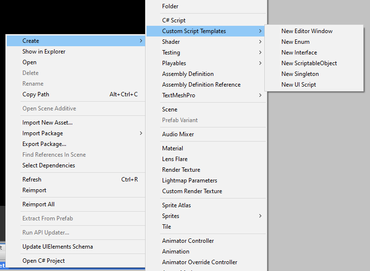

# Unity-CustomDefaultScripts
A collection of custom default scripts for Unity

<h3>HOW TO USE</h3>

Copy these files into your Unity ScriptTemplates folder located at: <code><i>[Unity Install Path]</i>\Editor\Data\ScriptTemplates</code> 
For example mine is: <code>C:\Program Files\Unity\Hub\Editor\2019.2.11f1\Editor\Data\Resources\ScriptTemplates</code>

Then when you right click in your Project window to create a new script, you will see a new folder named "Custom Templates", inside here are all of your new default templates! These work just like the default C# Script but provide you with extra templates to cut down on (all-be-in very small amounts) of boilerplate code.

<b>Be aware that if Unity is open when you copy these files over you will need to restart the application for them to be visible</b>

